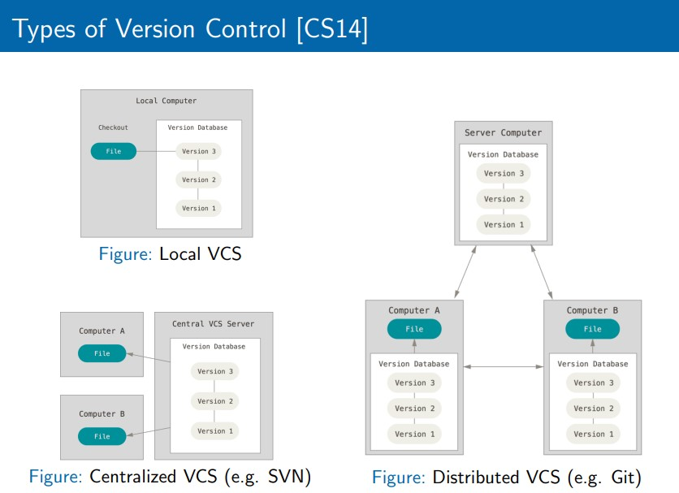

# HW1_MARKDOWN_PRACTICE

# 1. Introduction to Continuous Delivery (CD)
* What is Continous Delivery?

  Continuous Integration (CI) refers to the practice of regularly building and testing code changes and integrating them into the repository. In other words, it means that bug fixes or new feature development code is periodically merged into the Main Repository.
What if [Developer A] and [Developer B] both work on the same file, a.js, but merge their changes after a long time? The code might conflict, and resolving the tangled code could take a significant amount of time. Sometimes, resolving code conflicts could take longer than the actual coding time. Therefore, it is essential to develop in small increments and merge frequently and regularly.

* Continuous Delivery vs. Continous Deployment

  Continuous Delivery and Continuous Deployment both focus on automating the final deployment stage with the goal of making the deployment process as seamless as possible. The key difference lies in whether the deployment is manual or automatic.

  CD (Continuous Delivery) : After the code is built and tested in the CI stage, if it is confirmed to be deployment-ready, the deployment is performed manually by developers or a verification team.

  CD (Continuous Deployment) : After the code is built and tested in the CI stage, if it is confirmed to be deployment-ready, the deployment is performed automatically without any manual intervention.

  If the process automatically proceeds from Code → Build → Test → Staging, but the Deploy step is manual, it is called Continuous Delivery.
If the entire process, including Code → Build → Test → Staging → Deploy, is automated, it is called Continuous Deployment.
The key difference is whether the final stage is automated or not.

* CI vs. CD vs. Continous Deployment

> Source: Lecture materials, page 16.
* Key Components of CD
* Benefits of CD
* Why is Increased Release Frequency Important?
* Evolution of CD

# 2. Introduction to DevOps
* What is DevOps?

  DevOps is a combination of "Development" and "Operations," first introduced in 2009. It refers to a development environment or culture that breaks down the boundaries between development and operations, emphasizing communication, collaboration, and integration within a unified team.

  Previously, once developers completed their work, they had to hand it off to operators for deployment. This required developers and operators to communicate and coordinate, with operators needing time to understand the program. If communication issues arose, delays became inevitable.

  DevOps emerged as a new culture or environment to overcome these challenges.

  Benefits of Applying DevOps
  1. Speed
  By removing the back-and-forth communication between development and operations, work progresses faster. It also enables businesses to adapt quickly to customer demands, respond to market changes, and deliver results more efficiently.
  
  2. Faster Deployment
  Increased speed leads to faster program deployment. Faster deployment gives a competitive edge in the market, allowing companies to stay ahead of their competitors.
  
  3. Enhanced Collaboration
  DevOps emphasizes collaboration, naturally strengthening the cooperation between development and operations. This shared responsibility improves teamwork, increases program quality, and enhances team efficiency.
  
  4. Improved Quality
  With continuous delivery and integration, issues like bugs can be identified and addressed faster. Changes can be applied immediately, elevating the quality and completeness of the program. Additionally, real-time monitoring ensures performance can be assessed and optimized promptly.
  
  5. Security
  Automated compliance policies, granular control, and configuration management help maintain a high level of security.
  
  By integrating development and operations, DevOps boosts product release efficiency and organizational productivity, benefiting customers, companies, and teams alike.
  
  Core Practices of DevOps
  Continuous Integration (CI)
  Continuous Delivery (CD)
  Microservices
  Infrastructure as Code (IaC)
  Monitoring and Logging
  Collaboration
  
  DevOps is not about specific tools or creating a specialized team—it's a culture. When this culture takes root in a company, it significantly enhances organizational goals and project outcomes.

> Source: Lecture materials, page 23.

* Historical Context
* Core Principles
* Benefits of DevOps
* Key Practices
* DevOps Culture

# 3. Version Control
* Introduction to Version Control

  Branching Strategy

  GitHub Flow: A branching model where you create a branch for each feature during development, and merge it back into the main branch once the work is complete. The main branch is always kept in a deployable state.

  Trunk-Based Development: A branching model where all developers commit directly to the main branch. It is similar to GitHub Flow but minimizes the use of branches.

  Merge vs. Rebase:
  Merge: The basic method of combining a branch into the main branch. A merge commit is created in the history.
  Rebase: A method of moving the starting point of a branch to the latest commit of the main branch. It has the advantage of creating a cleaner history, but care must be taken as it rewrites history.

  Consistent Naming Conventions: Naming branches according to a consistent convention makes history management easier (e.g., feature/feature-name, bugfix/bug-number).

  Semantic Versioning: A method of clearly managing release versions using the Major.Minor.Patch format.

  Repository Management  
  Monorepo: A method of storing all code in a single repository.
  Advantages: Easy code sharing, easy global changes.
  Disadvantages: Performance issues can occur if the repository becomes too large, difficulty in access control and code management.

  Multi-repo: A method of using separate repositories for each project or team.
  Advantages: Small repository size reduces performance issues, easy access control.
  Disadvantages: Difficult code sharing, difficult global changes.

  Selection: The appropriate method should be selected considering company size, project characteristics, and team size.

> Source: Lecture materials, page 33.

* Introduction to Git
* Commit Message
* Branching and Tagging
* Repository Layout
* Hosting Providers
