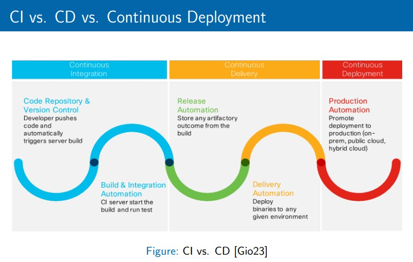
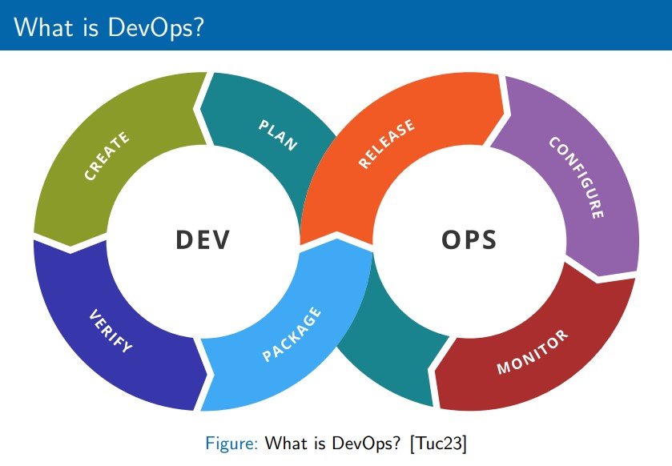
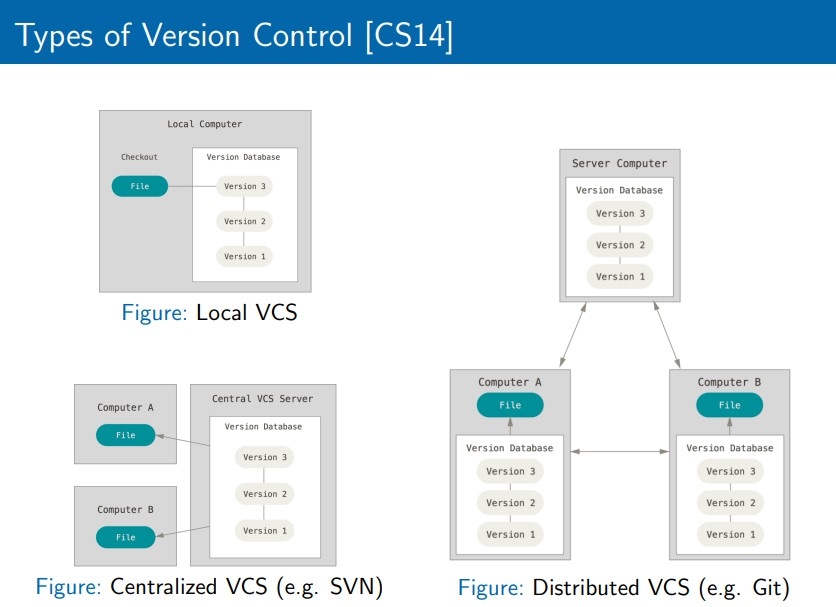

# HW1_MARKDOWN_PRACTICE

# 1. Introduction to Continuous Delivery (CD)
* What is Continous Delivery?
* Continuous Delivery vs. Continous Deployment
* CI vs. CD vs. Continous Deployment

> Citation: Lecture materials, page 16.

* Key Components of CD
* Benefits of CD
* Why is Increased Release Frequency Important?
* Evolution of CD

# 2. Introduction to DevOps
* What is DevOps?

> Citation: Lecture materials, page 23.

* Historical Context
* Core Principles
* Benefits of DevOps
* Key Practices
* DevOps Culture

# 3. Version Control
* Introduction to Version Control

> Citation: Lecture materials, page 33.

* Introduction to Git
* Commit Message
* Branching and Tagging
* Repository Layout
* Hosting Providers